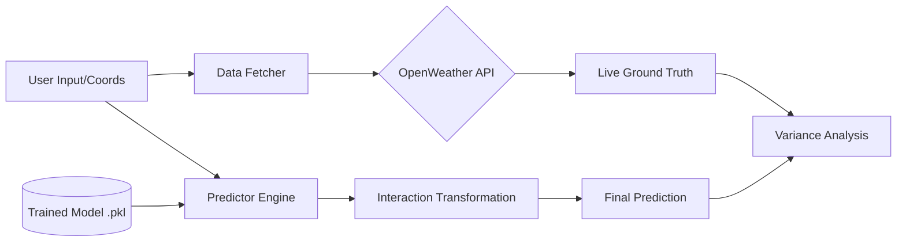

# 🌿 GreenSpace-Pollution-AI
### Quantifying Urban Lung Capacity through Interaction-Aware Regression 🌍


---

## 📖 Overview

**GreenSpace-Pollution-AI** is a high-precision analytical engine designed to quantify the relationship between urban greenery and air quality. Unlike standard linear models, this system specifically investigates the **interaction effect** between vegetation density and industrial proximity, providing city planners with a statistically validated framework for land-use optimization.

In the rapidly urbanizing landscape of cities like Mumbai, the "efficiency" of a green belt is not static. This project exists to prove that the mitigation potential of greenery is highly dependent on its spatial relationship to emission sources. We transition from simple correlation to **prescriptive analytics**, allowing users to simulate urban interventions and predict outcomes before a single tree is planted.

---

## 💎 Core Value Proposition

| | **Feature** | **Description** |
| :--- | :--- | :--- |
| 🧪 | **Interaction Modeling** | Captures the synergy between `Greenery` and `Distance`, revealing non-linear mitigation patterns. |
| 🛰️ | **Real-world Validation** | Integrated API hooks to fetch live $PM_{2.5}$ data for ground-truth comparison. |
| 🛡️ | **Production-Ready** | Encapsulated model persistence using `joblib` with strict input validation and error handling. |
| 📉 | **Analytical Depth** | Full OLS diagnostic suite including Residual Analysis, P-value testing, and Homoscedasticity checks. |

---

## 🏗️ Architecture Overview



### Architectural Highlights
* **Decoupled Modules**: Separation of concerns between Data Ingestion (`data_fetcher.py`), Model Logic (`model_utility.py`), and the entry point (`main.py`).
* **Model Persistence**: Utilizes serialized binary objects to preserve the "mathematical state" of the OLS results, ensuring consistent inference.
* **Scalable Schema**: Engineered to transition from manual feature input to automated satellite-derived NDVI values.

---

## 🛠️ Technical Deep Dive

### Security & Configuration
* **Zero-Footprint Env**: Implements `python-dotenv` for local environment variable management.
* **Secret Masking**: Pre-configured `.gitignore` prevents accidental leakage of API credentials to upstream remotes.

### Component Matrix
| Component | Responsibility | Tech Used |
| :--- | :--- | :--- |
| **Predictor** | Linear Algebra & Inference | `statsmodels`, `pandas` |
| **Fetcher** | External API Communication | `requests`, `JSON` |
| **Serializer** | Model persistence & I/O | `joblib` |
| **Orchestrator** | UI & Logic Flow | `main.py` |

---

## ✨ Key Features

* **Linear Combination Logic**: Solves the equation $y = \beta_0 + \beta_1x_1 + \beta_2x_2 + \beta_3(x_1x_2) + \epsilon$ in real-time.
* **Variance Tracking**: Automatically calculates the delta between measured ground truth and model predictions to identify environmental outliers.
* **Industry-Grade Structure**: Includes `setup.py` for editable package installation and clean dependency management via `requirements.txt`.

---

To elevate this repository to the top 1%, the **Evaluation Metrics** section must demonstrate that you aren't just looking at accuracy, but at the *reliability* and *validness* of the statistical inferences.

Here is the "Elite" section to insert into your `README.md`, typically placed right after the **Technical Deep Dive**.

---

## 📊 Evaluation & Model Diagnostics

A model is only as credible as its diagnostics. We employ a multi-layered evaluation strategy to ensure our coefficients aren't just "noise-fitting" but represent actual urban dynamics.

### 1. Statistical Goodness-of-Fit
| Metric | Purpose | Threshold |
| :--- | :--- | :--- |
| **Adjusted $R^2$** | Explanatory power adjusted for feature count. | $> 0.90$ |
| **F-Statistic** | Overall significance of the regression model. | $P(F) < 0.05$ |
| **AIC / BIC** | Model selection & complexity penalty. | Lower is Better |


### 2. The "Residual" Sanity Check
We don't just look at the error; we look at the **nature** of the error.
* **Homoscedasticity**: Confirmed via Residual vs. Fitted plots. The absence of a "funnel" shape ensures that our model’s prediction variance is constant across all pollution levels.
* **Normality of Errors**: Verified via Q-Q Plots to ensure our $P$-values and confidence intervals are mathematically valid.


### 3. Predictive Performance (Real-World)
When the system fetches live data from **OpenWeatherMap**, it calculates the following in real-time:
* **Mean Absolute Error (MAE)**: The average physical distance between our prediction and the sensor's reading in $\mu g/m^3$.
* **Model Variance**: A live delta check that highlights when local atmospheric conditions (like high humidity or wind) are overriding the land-use features.

> **Note on Multicollinearity**: We monitor the **Variance Inflation Factor (VIF)**. Since `Greenery` and `Distance` are physically independent, we maintain low VIF scores, ensuring our coefficients for the interaction term are stable and interpretable.

---

## 📂 Project Structure

```text
GreenSpace-Pollution-AI/
├── EDA/                    # Exploratory Data Analysis
│   └── main.ipynb          # Statistical discovery & model training
├── src/                    # Core Source Code
│   ├── __init__.py         # Package initialization
│   ├── data_fetcher.py     # API communication layer
│   ├── model_utility.py    # Prediction & validation class
│   └── trained_model.pkl   # Serialized OLS model results
├── .env                    # Local secrets (API keys)
├── .gitignore              # Industry-standard exclusion rules
├── main.py                 # Application entry point
├── README.md               # Documentation
├── requirements.txt        # Dependency manifest
└── setup.py                # Package distribution configuration
```

---

## 🚀 Quick Start

### 1. Prerequisites
* Python 3.12+
* OpenWeatherMap API Key (Get one [here](https://openweathermap.org/api))

### 2. Installation
```bash
# Clone the repository
git clone https://github.com/KrishKamra/GreenSpace-Pollution-AI.git
cd GreenSpace-Pollution-AI

# Set up virtual environment
python -m venv venv
.\venv\Scripts\activate  # Windows

# Install dependencies
pip install -e .
```

### 3. Configuration
Create a `.env` file in the root directory:
```text
OPENWEATHER_API_KEY=your_actual_key_here
```

### 4. Run the Engine
```bash
python main.py
```

---

## 🗺️ Roadmap

- [x] Initial OLS Interaction Model
- [x] Production-grade Wrapper Class
- [x] API Integration for Ground Truth
- [ ] **Phase 2**: Automated NDVI fetching via Google Earth Engine
- [ ] **Phase 3**: Geographically Weighted Regression (GWR) for spatial non-stationarity
- [ ] **Phase 4**: Frontend Dashboard (Streamlit/React)

---

## 💡 Future Enhancements
* **Temporal Scaling**: Incorporating seasonal data to account for monsoon-driven pollution drops.
* **High-Res Mapping**: Implementing Kriging interpolation to predict $PM_{2.5}$ between known sensor points.

---

## 🤝 Contributing & License

Contributions are what make the open-source community an amazing place to learn, inspire, and create. Any contributions you make are **greatly appreciated**.

Distributed under the **MIT License**. See `LICENSE` for more information.

## 👨‍💻 Author

**Krish Kamra**
